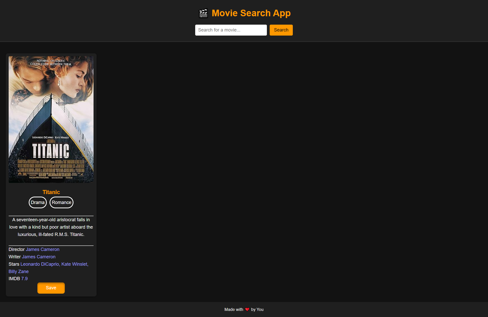

# 🎬 Movie Search App

A simple web application that allows users to search for movies using the [OMDb API](http://www.omdbapi.com/). It displays movie details such as the title, poster, genre, plot, director, writer, actors, and IMDb rating. Users can also save movies for later viewing using **localStorage**.

---

## 🌐 Live Demo

Check out the live version here: [Movie Search App](https://rehmali.github.io/your-repo-name/)

---

## ✨ Features

- 🔍 **Search Movies:** Enter a movie name to fetch details from the OMDb API.
- 🖼️ **Movie Details:** Displays poster, genres, plot, and key information.
- ⚠️ **Error Handling:** Shows a "Movie Not Found" message if the search query does not return results.
- ⏳ **Loading Indicator:** Displays a "Loading..." message while fetching movie data.

---

## 🛠️ Tech Stack

- **HTML5** – Structure of the app.
- **CSS3** – Styling and layout.
- **JavaScript (ES6)** – Core functionality, DOM manipulation, and API handling.
- **OMDb API** – External movie data source.
- **localStorage** – Persistent storage for saved movies.

---

## 🚀 How It Works

1. The user types a movie name in the search bar and submits the form.
2. The app fetches data from the OMDb API and displays the movie card.
3. Saved movies remain even after refreshing the page or performing new searches.

---

## 📸 Screenshot

---
